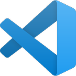
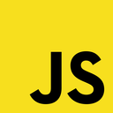

# TypeScript for Testers - Express Basics 🧪

> [!TIP]
> 💡 Choose your language:
>
> - 🇬🇧 [English](./README.eng.md)
> - 🇵🇱 [Polski](./README.md)

Welcome to **TypeScript for a Tester** - a practical guide designed specifically for software testers who want to learn TypeScript!

You'll work through theory, examples, and hands-on exercises to build a strong foundation in TypeScript. **No prior programming experience is required** – we'll start from the very basics and guide you step by step.

> [!IMPORTANT]
> Check out our free **YouTube** series from this course:
> [](https://www.youtube.com/playlist?list=PLfKhn9AcZ-cD2AJmR8W5C4qGG9e5YiAGa)

> [!TIP]
> 🧠 This is a **condensed overview** of TypeScript focused on the most important features commonly used in test automation. If you want to go deeper, check out the additional materials and courses listed below:
>
> - 🇵🇱 Full course - [**JavaScript and TypeScript for Testers**](https://jaktestowac.pl/js-ts/)
> - 🇵🇱 Full course - [**Professional Test Automation with Playwright**](https://jaktestowac.pl/playwright/)
> - 🇵🇱 Full course - [**Back-end Test Automation**](https://jaktestowac.pl/api/)

---

# Table of Contents

- [📚 What You'll Learn](#-what-youll-learn)
- [🎯 Target Audience](#-target-audience)
- [📋 Prerequisites](#-prerequisites)
- [🚀 Getting Started](#-getting-started)
    - [1. Clone this repository](#1-clone-this-repository)
    - [2. Install dependencies](#2-install-dependencies)
    - [3. Verify your setup](#3-verify-your-setup)
    - [4. Run your first TypeScript example](#4-run-your-first-typescript-example)
- [�️ Learning Path](#️-learning-path)
- [🧭 How to Study](#-how-to-study)
- [🎯 Progress Tracking](#-progress-tracking)
- [�💡 PRO TIP: How to quickly run TypeScript files?](#-pro-tip-how-to-quickly-run-typescript-files)
    - [Using Code Runner VS Code extension](#using-code-runner-vs-code-extension)
    - [Using tsx](#using-tsx)
- [⚒️ Project Structure](#️-project-structure)
- [🛠️ Troubleshooting](#️-troubleshooting)
- [📘 Overview](#-overview)
    - [JavaScript vs. TypeScript](#javascript-vs-typescript)
    - [TypeScript](#typescript)
    - [TSX (TypeScript Executor)](#tsx-typescript-executor)
- [📚 Links and Resources](#-links-and-resources)
- [📞 Contact & Support](#-contact--support)
- [📚 Learning Resources](#-learning-resources)
    - [🇵🇱 Polish Resources](#-polish-resources)
    - [🇬🇧 English Resources](#-english-resources)
- [📝 Exercises](#-exercises)

# 📚 What You'll Learn

This repository will teach you the **essential TypeScript concepts** that are commonly used in test automation.  
You'll also learn the **very basics of programming**, so you don't need any technical background to start.

As a tester, learning TypeScript will help you:

- **Read and understand** code with confidence
- **Write better test automation** scripts
- **Collaborate effectively** with developers and automation engineers

# 🎯 Target Audience

- Manual testers starting their automation journey
- QA engineers expanding their automation skills
- Test automation engineers working with TypeScript projects
- Anyone in testing who wants to level up their technical skills

# 📋 Prerequisites

Installed on your machine:

- **VS Code** - a code editor - https://code.visualstudio.com/
- **Node.js** (LTS v22.17.0) https://nodejs.org/

<div align="center" style="display: flex; gap: 100px; justify-content: center;">


</div>

# 🚀 Getting Started

## 1. Clone this repository

```bash
git clone <repository-url>
cd typescript-dla-testera
```

## 2. Install dependencies

```bash
npm install
```

## 3. Verify your setup

```bash
# Check if Node.js is installed
node --version

# Check if npm is installed
npm --version

# Install project dependencies
npm install
```

## 4. Run your first TypeScript example

```bash
# Run the hello world example
npm run t0s1

# Or run it directly with tsx
npx tsx theory/0-base/1-hello-world.ts
```

> [!TIP]
> 💡 What is `tsx`? [tsx](https://tsx.is/)
> `tsx` is a tool that allows you to run TypeScript files directly without needing to compile them first.
> It runs your TypeScript code with modern and sensible defaults, making it user-friendly and especially great for beginners.

> [!TIP]
> 💡 What is `npx`? [npx](https://docs.npmjs.com/cli/v11/commands/npx)
> It is a package runner tool that comes with npm. It allows you to run Node.js packages without installing them globally.

# 💡 PRO TIP: How to quickly run TypeScript files?

## Using Code Runner VS Code extension

> [!TIP]
> 💡 This is the easiest way to run TypeScript files in VS Code!

You can also use the **Code Runner** extension in VS Code to run TypeScript files directly!

1. Install the [Code Runner extension](https://marketplace.visualstudio.com/items?itemName=formulahendry.code-runner).
2. Open a TypeScript file (e.g., `theory/0-base/01-hello-world.ts`).
3. To run:

- click right mouse button and select **Run Code**
- use the shortcut `Ctrl + Alt + N` (Windows/Linux) or `Cmd + Option + N` (Mac).

This will execute the TypeScript file using `tsx` automatically!

## Using tsx

You can run TypeScript files directly using `tsx` without compiling them first.
This is great for quick testing and learning!

```bash
npx tsx <file.ts>
```

For example, to run the first TypeScript example:

```bash
npx tsx theory/0-base/01-hello-world.ts
```

# ⚒️ Project Structure

> [!TIP]
> 📖 **Looking for the full syllabus and lesson index?**
> Check out [theory/README.md](theory/README.md) for a detailed list of all lessons and modules in the course!

```
typescript-for-testers/
├── README.md               # Project documentation (English)
├── README.pl.md            # Project documentation (Polish)
├── package.json            # Project configuration and npm scripts
├── tsconfig.json           # TypeScript configuration
├── assets/                 # Images and logos
├── theory/                 # TypeScript learning modules with examples
│   ├── README.md           # Course README syllabus and lesson index
│   ├── 0-base/             # Getting started
│   ├── 1-variables-and-types/  # Variables and basic types
│   ├── 2-operators-and-expressions/  # Operators and expressions
│   ├── 3-conditionals/     # Conditional statements
│   ├── 4-arrays-and-loops/ # Arrays and loops
│   ├── 5-functions/        # Functions and parameters
│   ├── 6-async-await/      # Asynchronous programming
│   ├── 7-modules-and-ecosystem/  # Modules and packages
│   ├── 8-objects-interfaces/  # Objects and interfaces
│   └── 9-ts-features/      # Advanced TypeScript features
└── exercises/              # Practice exercises (work in progress)
    ├── 0-base/             # Basic exercises
    └── 1-variables-and-types/  # Variable exercises
```

# 📝 Exercises

Looking to practice what you've learned?

The `exercises/` directory contains practical, hands-on tasks designed to help you apply and reinforce each concept from the course. Exercises are grouped by topic, mirroring the course structure. Each exercise encourages you to experiment, make mistakes, and learn by doing—an essential part of mastering programming. Solutions are provided in each section so you can check your work and understand different approaches.

# 🛠️ Troubleshooting

## Common Issues and Solutions

**Issue**: `node: command not found`  
**Solution**: Install Node.js from https://nodejs.org/

**Issue**: `npx tsx: command not found`  
**Solution**: Run `npm install` in the project directory

**Issue**: TypeScript errors in VS Code  
**Solution**: Install the TypeScript extension and check if `tsconfig.json` exists

**Issue**: Code Runner not working  
**Solution**:

1. Install the Code Runner extension
2. Check if tsx is installed: `npm list tsx`
3. Restart VS Code

---

# 📘 Overview

## JavaScript vs. TypeScript

Before we dive into TypeScript, it's helpful to understand **JavaScript** – the language TypeScript is built on.

<div align="center">

</div>

**JavaScript** is the most widely used programming language for the web!

It runs in the browser and on servers (via Node.js), allowing developers to build interactive websites, backend services, and even automated tests.

**TypeScript** builds on top of JavaScript by adding static typing and modern features that help you catch bugs earlier and write more maintainable code.

If you don't know JavaScript yet – no worries!

This course will teach you the basics of both JavaScript and TypeScript as you go.

<div align="center">

</div>

## TypeScript

TypeScript is a **superset** of JavaScript.

It introduces static typing, modern language features, and powerful tooling to help developers and testers write safer, more maintainable code - especially in test automation projects.

> [!TIP]
> 🧠 This is a condensed overview of TypeScript focused on the most relevant features used in test automation. For a deeper dive, check out our full courses at [JavaScript and TypeScript for Testers](https://jaktestowac.pl/js-ts/)

Key features include:

- **Type Safety** - Catch errors early at compile time instead of runtime
- **Structured Code** - Use interfaces, enums, and modules for clear contracts and reusable components
- **Better Reusability** - Create flexible and type-safe logic with generics and type aliases
- **Smarter Editor Support** - Enjoy rich autocompletion, inline documentation, and type checking
- **Tooling Integration** - Work with ESLint, Prettier, and testing frameworks
- **Customization** - Configure settings via tsconfig.json
- **Strong Ecosystem** - Use popular libraries with first-class TypeScript support

## TSX (TypeScript Executor)

**Tsx** is a modern TypeScript execution environment that allows you to run TypeScript files directly without needing to compile them first. It provides a fast and efficient way to execute TypeScript code, making it ideal for testing and prototyping.

This project uses tsx to run .ts files without compilation. It's ideal for fast feedback and test-driven learning.

# 📚 Links and Resources

- [TypeScript](https://www.typescriptlang.org) - TypeScript documentation
- [Tsx](https://tsx.is/) - A TypeScript execution environment

> [!IMPORTANT]
> Check out our free **YouTube** series from this course:
>
> [](https://www.youtube.com/playlist?list=PLfKhn9AcZ-cD2AJmR8W5C4qGG9e5YiAGa)

# 📞 Contact & Support

Feel free to reach out to us:

- 🌐 **Website**: [jaktestowac.pl](https://jaktestowac.pl)
- 💼 **LinkedIn**: [jaktestowac.pl](https://www.linkedin.com/company/jaktestowac/)
- 💬 **Discord**: [Polish Playwright Community](https://discord.gg/mUAqQ7FUaZ)
- 📧 **Support**: Check our website for contact details

---

# 📚 Learning Resources

We have gathered a collection of resources to help you learn and master Playwright, both in Polish and English. Whether you're a beginner or an advanced user, these resources will help you enhance your skills and knowledge.

## 🇵🇱 Polish Resources

- [JavaScript and TypeScript for Testers](https://jaktestowac.pl/js-ts/) - Comprehensive (13h+) course on JavaScript and TypeScript for testers, with practical examples and exercises
- [Professional Test Automation with Playwright](https://jaktestowac.pl/playwright/) - Comprehensive (100h+) course on Playwright, test automation, CI/CD and test architecture
- [Back-end Test Automation](https://jaktestowac.pl/api/) - Comprehensive (45h+) course on Back-end Test Automation with Postman, Mocha, Chai, and Supertest
- [Free Playwright Resources](https://jaktestowac.pl/darmowy-playwright/) - Comprehensive and Free Polish learning materials
- [Playwright Basics](https://www.youtube.com/playlist?list=PLfKhn9AcZ-cD2TCB__K7NP5XARaCzZYn7) - YouTube series (Polish)
- [Playwright Elements](https://www.youtube.com/playlist?list=PLfKhn9AcZ-cAcpd-XN4pKeo-l4YK35FDA) - Advanced concepts (Polish)
- [Playwright MCP](https://www.youtube.com/playlist?list=PLfKhn9AcZ-cCqD34AG5YRejujaBqCBgl4) - MCP course (Polish)
- [Discord Community](https://discord.gg/mUAqQ7FUaZ) - First Polish Playwright community!
- [Playwright Info](https://playwright.info/) - first and only Polish Playwright blog

## 🇬🇧 English Resources

- [VS Code Extensions](https://marketplace.visualstudio.com/publishers/jaktestowac-pl) - Our free Playwright plugins
- [Playwright Documentation](https://playwright.dev/docs/intro) - Official documentation
- [Playwright GitHub](https://github.com/microsoft/playwright) - Source code and issues

_PS. For more resources and updates, follow us on our [website](https://jaktestowac.pl) and [GitHub](https://github.com/jaktestowac)._

---

**Happy testing and automation!** 🚀

**jaktestowac.pl Team** ❤️💚

_PS. For more resources and updates, follow us on our [website](https://jaktestowac.pl) and [GitHub](https://github.com/jaktestowac)._

---

_Built with ❤️💚 for the Playwright and test automation community_
