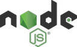
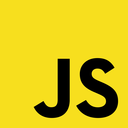
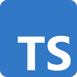

# TypeScript dla Testerów - Ekspresowe Podstawy 🧪

> [!TIP]
> 💡 Wybierz swój język:
>
> - 🇬🇧 [English](./README.eng.md)
> - 🇵🇱 [Polski](./README.md)

Witamy w **TypeScript dla Testera** - praktycznym przewodniku zaprojektowany specjalnie dla testerów, którzy chcą nauczyć się programować w języku TypeScript!

Wspólnie przeprowadzimy Cię przez teorię, przykładami i praktycznymi ćwiczeniami.
Dzięki temu zbudujesz solidne podstawy w TypeScript. 

**Nie jest wymagane żadne wcześniejsze doświadczenie programistyczne**.

Zaczniemy od podstaw i poprowadzimy Cię krok po kroku przez rózne koncepty.

> [!IMPORTANT]
> Sprawdź nasze darmowe nagrania z tego kursu na **YouTube**:
> [](https://www.youtube.com/playlist?list=PLfKhn9AcZ-cD2AJmR8W5C4qGG9e5YiAGa)

> [!TIP]
> 🧠 To jest **skrócony przegląd** języka TypeScript skupiony na najważniejszych funkcjach powszechnie używanych w automatyzacji testów. 
>
> **Chcesz barzdiej zgłębić temat?**
> 
> Sprawdź dodatkowe materiały i kursy wymienione poniżej:
>
> - 🇵🇱 [**JavaScript i TypeScript dla Testerów**](https://jaktestowac.pl/js-ts/)
> - 🇵🇱 [**Profesjonalna Automatyzacja Testów z Playwright**](https://jaktestowac.pl/playwright/)
> - 🇵🇱 [**Automatyzacja REST API i back-endu**](https://jaktestowac.pl/api/)

---

# Spis treści

- [📚 Czego się nauczysz](#-czego-się-nauczysz)
- [🎯 Grupa docelowa](#-grupa-docelowa)
- [📋 Wymagania wstępne](#-wymagania-wstępne)
- [🚀 Pierwsze kroki](#-pierwsze-kroki)
    - [0. Zweryfikuj swoją konfigurację](#0-zweryfikuj-swoją-konfigurację)
    - [1. Sklonuj to repozytorium](#1-sklonuj-to-repozytorium)
    - [2. Zainstaluj zależności](#2-zainstaluj-zależności)
    - [3. Uruchom swój pierwszy skrypt TypeScript](#3-uruchom-swój-pierwszy-skrypt-typescript)
- [🗺️ Ścieżka nauki](#️-ścieżka-nauki)
- [🧭 Jak się uczyć](#-jak-się-uczyć)
- [🎯 Śledzenie postępów](#-śledzenie-postępów)
- [💡 WSKAZÓWKA: Jak szybko uruchamiać pliki TypeScript?](#-wskazówka-jak-szybko-uruchamiać-pliki-typescript)
    - [Używając rozszerzenia Code Runner w VS Code](#używając-rozszerzenia-code-runner-w-vs-code)
    - [Używając tsx](#używając-tsx)
- [⚒️ Struktura projektu](#️-struktura-projektu)
- [📝 Ćwiczenia](#-ćwiczenia)
- [🛠️ Rozwiązywanie problemów](#-rozwiązywanie-problemów)
- [📘 Przegląd](#-przegląd)
    - [JavaScript vs. TypeScript](#javascript-vs-typescript)
    - [TypeScript](#typescript)
    - [TSX (TypeScript Executor)](#tsx-typescript-executor)
- [📚 Linki i zasoby](#-linki-i-zasoby)
- [📞 Kontakt i wsparcie](#-kontakt-i-wsparcie)
- [📚 Materiały do nauki](#-materiały-do-nauki)
    - [🇵🇱 Polskie zasoby](#-polskie-zasoby)
    - [🇬🇧 Angielskie zasoby](#-angielskie-zasoby)

# 📚 Czego się nauczysz

To repozytorium pomoże Ci **zrozumieć podstawowe koncepcje TypeScript**, które są powszechnie używane w automatyzacji testów.  
Nauczysz się również **podstaw programowania**!
Więc nie potrzebujesz żadnego technicznego background'u, aby zacząć!

Jako tester, nauka TypeScript pomoże Ci:

- **Czytać i rozumieć** kod (zarówno testów automatycznych, jak i aplikacji)
- **Tworzyć i modyfikować** proste skrypty
- **Pisać lepsze skrypty** we frameworku
- **Efektywnie współpracować** z programistami i inżynierami automatyzacji

# 🎯 Grupa docelowa

- **Testerzy manualni** rozpoczynający swoją przygodę z automatyzacją
- **Inżynierowie QA** rozszerzający swoje umiejętności automatyzacji
- **Inżynierowie automatyzacji testów** pracujący z projektami TypeScript
- **Każdy**, kto chce podnieść swoje umiejętności techniczne

# 📋 Wymagania

Czego potrzebujesz na swoim komputerze:

- **VS Code** - edytor kodu - https://code.visualstudio.com/
- **Node.js** (LTS v22.17.0) https://nodejs.org/

<div align="center" style="display: flex; gap: 100px; justify-content: center;">


</div>

# 🚀 Pierwsze kroki

## 0. Zweryfikuj swoją konfigurację

Upewnij się, że masz zainstalowane Node.js i npm (Node Package Manager). Możesz to sprawdzić, uruchamiając następujące polecenia w terminalu:

```bash
# Sprawdź czy Node.js jest zainstalowany
node --version

# Sprawdź czy npm jest zainstalowany
npm --version
```

## 1. Sklonuj to repozytorium

W konsoli lub terminalu, przejdź do katalogu, w którym chcesz umieścić projekt, a następnie sklonuj repozytorium:

```bash
git clone https://github.com/jaktestowac/typescript-dla-testera
cd typescript-dla-testera
```

## 2. Zainstaluj zależności

Uruchom terminal w katalogu projektu i wpisz:

```bash
npm install
```

## 3. Uruchom swój pierwszy skrypt TypeScript

Teraz jesteś gotowy, aby uruchomić swój pierwszy skrypt TypeScript!
W katalogu `theory/0-base/` znajdziesz plik `1-hello-world.ts`, który jest prostym przykładem.
Możesz go uruchomić na dwa sposoby:

```bash
# Uruchom skrypt hello world
npm run t0s1
```

lub uruchomić go bezpośrednio z `tsx`:

```bash
# Lub uruchom go bezpośrednio z tsx
npx tsx theory/0-base/1-hello-world.ts
```

# 💡 WSKAZÓWKA: Jak szybko uruchamiać pliki TypeScript?

## Używając rozszerzenia Code Runner w VS Code

> [!TIP]
> 💡 To najłatwiejszy sposób na uruchamianie plików TypeScript w VS Code!

Możesz również użyć rozszerzenia **Code Runner** w VS Code, aby uruchamiać pliki TypeScript bezpośrednio!

1. Zainstaluj [rozszerzenie Code Runner](https://marketplace.visualstudio.com/items?itemName=formulahendry.code-runner).
2. Otwórz plik TypeScript (np. `theory/0-base/1-hello-world.ts`).
3. Aby uruchomić:

- kliknij prawym przyciskiem myszy i wybierz **Run Code**
- użyj skrótu `Ctrl + Alt + N` (Windows/Linux) lub `Cmd + Option + N` (Mac).

To wykona plik TypeScript używając `tsx` automatycznie!

## Używając tsx

Możesz uruchamiać pliki TypeScript bezpośrednio używając `tsx` bez wcześniejszej kompilacji.
To świetne rozwiązanie do szybkiego testowania i nauki!

```bash
npx tsx <file.ts>
```

Na przykład, aby uruchomić pierwszy przykład TypeScript:

```bash
npx tsx theory/0-base/1-hello-world.ts
```

# ⚒️ Struktura projektu

> [!TIP]
> 📖 **Szukasz pełnego programu kursu i spisu lekcji?**
> Zajrzyj do [theory/README.md](theory/README.md), gdzie znajdziesz szczegółowy spis wszystkich lekcji i modułów!

```
typescript-dla-testera/
├── README.eng.md           # Dokumentacja projektu (angielski)
├── README.md               # Dokumentacja projektu (polski)
├── package.json            # Konfiguracja projektu i skrypty npm
├── tsconfig.json           # Konfiguracja TypeScript
├── assets/                 # Obrazy i loga
├── theory/                 # Moduły nauki TypeScript z przykładami
│   ├── README.md           # Program kursu i indeks lekcji
│   ├── 0-base/             # Pierwsze kroki
│   ├── 1-variables-and-types/
│   ├── 2-operators-and-expressions/
│   ├── 3-conditionals/
│   ├── 4-arrays-and-loops/
│   ├── 5-functions/
│   ├── 6-objects-interfaces/
│   ├── 7-modules-and-ecosystem/
│   ├── 8-async-await/
│   └── 9-ts-features/
└── exercises/              # Ćwiczenia praktyczne
    ├── 0-base/
    └── 1-variables-and-types/
```

# 📝 Ćwiczenia

Chcesz przećwiczyć to, czego się nauczyłeś?

Katalog `exercises/` zawiera praktyczne zadania i wyzwania, które pomogą Ci utrwalić i zastosować wiedzę z kursu.

Ćwiczenia są pogrupowane tematycznie, zgodnie ze strukturą kursu. Każde zadanie zachęca do eksperymentowania, popełniania błędów i nauki przez praktykę. W każdej sekcji znajdziesz również rozwiązania, abyś mógł sprawdzić swoje odpowiedzi i poznać różne podejścia.

# 🛠️ Rozwiązywanie problemów

## Typowe problemy i rozwiązania

🚨 **Problem**: `node: command not found`  
**Rozwiązanie**: Zainstaluj Node.js z https://nodejs.org/

🚨 **Problem**: `npx tsx: command not found`  
**Rozwiązanie**: Uruchom `npm install` w katalogu projektu lub zainstaluj `tsx` globalnie: `npm install -g tsx`

🚨 **Problem**: Błędy TypeScript w VS Code  
**Rozwiązanie**: Zainstaluj rozszerzenie TypeScript i sprawdź czy `tsconfig.json` istnieje w katalogu głównym projektu.

🚨 **Problem**: Błędy podczas uruchamiania skryptów
**Rozwiązanie**: Upewnij się, że używasz `npx tsx` do uruchamiania skryptów TypeScript.

🚨 **Problem**: `npm run t0s1` nie działa
**Rozwiązanie**: Sprawdź, czy skrypt jest poprawnie zdefiniowany w `package.json`.

🚨 **Problem**: Code Runner nie działa  
**Rozwiązanie**:

1. Zainstaluj rozszerzenie Code Runner z [marketplace](https://marketplace.visualstudio.com/items?itemName=formulahendry.code-runner)
2. Sprawdź czy tsx jest zainstalowany: `npm list tsx`
3. Sprawzd konfigurację Code Runner w ustawieniach VS Code:
    - Otwórz ustawienia (Ctrl + ,)
    - Wyszukaj `code-runner.executorMap`
    - Upewnij się, że `typescript` jest ustawione na `npx tsx`
4. Uruchom ponownie VS Code
5. Upewnij się, że plik ma rozszerzenie `.ts`

---

# 📘 Przegląd

## JavaScript vs. TypeScript

Zanim zagłębimy się w TypeScript, warto zrozumieć **JavaScript** – język, na którym zbudowany jest TypeScript!

<div align="center">

</div>

**JavaScript** to najpopularniejszy język programowania na świecie!

Działa w przeglądarce i na serwerach (poprzez Node.js), pozwalając programistom budować interaktywne strony internetowe, usługi backendowe, a nawet testy.

**TypeScript** bazuje na JavaScript, dodając statyczne typowanie i nowoczesne funkcje, które pomagają wyłapywać błędy wcześniej i pisać kod, który jest łatwiejszy w utrzymaniu.

Jeśli nie znasz jeszcze JavaScript – nie martw się!

Ten kurs nauczy Cię podstaw zarówno JavaScript, jak i TypeScript w trakcie nauki.

<div align="center">

</div>

## TypeScript

TypeScript to **rozszerzenie** języka JavaScript.

Wprowadza statyczne typowanie, nowoczesne funkcje językowe i potężne narzędzia, które pomagają programistom i testerom pisać bezpieczniejszy, łatwiejszy w utrzymaniu kod - szczególnie w projektach automatyzacji testów.

> [!TIP]
> 🧠 To jest skrócony materiał o TypeScript!
> Skupiamy się tutaj na najważniejszych funkcjach używanych w automatyzacji testów. Aby zgłębić temat, sprawdź nasze pełne kursy [JavaScript i TypeScript dla Testera](https://jaktestowac.pl/js-ts/).

Kluczowe funkcje obejmują:

- **Bezpieczeństwo typów** - Wyłapuj błędy wcześnie w czasie kompilacji zamiast w czasie wykonania
- **Ustrukturyzowany kod** - Używaj interfejsów, enums i modułów dla jasnych kontraktów i komponentów wielokrotnego użytku
- **Lepsza możliwość ponownego użycia** - Twórz elastyczną i type-safe logikę z generics i aliasami typów
- **Inteligentniejsze wsparcie edytora** - Ciesz się bogatym autouzupełnianiem, dokumentacją inline i sprawdzaniem typów
- **Integracja z narzędziami** - Pracuj z ESLint, Prettier i frameworkami testowymi
- **Dostosowywanie** - Konfiguruj ustawienia poprzez tsconfig.json
- **Silny ekosystem** - Używaj popularnych bibliotek z pierwszorzędnym wsparciem TypeScript

## TSX (TypeScript Executor)

**Tsx** to nowoczesne środowisko wykonawcze TypeScript, które pozwala uruchamiać pliki TypeScript bezpośrednio bez potrzeby wcześniejszej kompilacji. Zapewnia szybki i efektywny sposób wykonywania kodu TypeScript, co czyni go idealnym do testowania i prototypowania.

Ten projekt używa tsx do uruchamiania plików .ts bez kompilacji. Jest idealny do szybkiego feedback'u i nauki programowania.

# 📚 Linki i zasoby

- [TypeScript](https://www.typescriptlang.org) - Dokumentacja TypeScript
- [Tsx](https://tsx.is/) - Środowisko wykonawcze TypeScript

> [!IMPORTANT]
> Sprawdź nasze darmowe nagrania z tego kursu na **YouTube**:
>
> [](https://www.youtube.com/playlist?list=PLfKhn9AcZ-cD2AJmR8W5C4qGG9e5YiAGa)

# 📞 Kontakt i wsparcie

Skontaktuj się z nami:

- 🌐 **Strona internetowa**: [jaktestowac.pl](https://jaktestowac.pl)
- 💼 **LinkedIn**: [jaktestowac.pl](https://www.linkedin.com/company/jaktestowac/)
- 💬 **Discord**: [Polska społeczność Playwright](https://discord.gg/mUAqQ7FUaZ)
- 📧 **Wsparcie**: Sprawdź naszą stronę internetową, aby uzyskać dane kontaktowe

---

# 📚 Materiały do nauki

Zebraliśmy kolekcję zasobów, które pomogą Ci nauczyć się i opanować Playwright, zarówno w języku polskim, jak i angielskim. Niezależnie od tego, czy jesteś początkującym, czy zaawansowanym użytkownikiem, te zasoby pomogą Ci poszerzyć umiejętności i wiedzę.

## 🇵🇱 Polskie zasoby

- [JavaScript i TypeScript dla Testera](https://jaktestowac.pl/js-ts/) - Kurs o JavaScript i TypeScript dla testerów, z praktycznymi przykładami i ćwiczeniami
- [Profesjonalna Automatyzacja z Playwright](https://jaktestowac.pl/playwright/) - Kompleksowy, ponad 100 godzinny materiał o projektowaniu frameworka, CI/CD, architekturze testów, wzorcach i dobrych praktykach
- [Darmowe zasoby Playwright](https://jaktestowac.pl/darmowy-playwright/) - Kompleksowe polskie materiały edukacyjne
- [Podstawy Playwright](https://www.youtube.com/playlist?list=PLfKhn9AcZ-cD2TCB__K7NP5XARaCzZYn7) - Seria YouTube (polski)
- [Playwright Elements](https://www.youtube.com/playlist?list=PLfKhn9AcZ-cAcpd-XN4pKeo-l4YK35FDA) - Zaawansowane koncepcje (polski)
- [Automatyzacja back-endu z REST API](https://jaktestowac.pl/api/) - Kompleksowy (45h+) kurs o automatyzacji testów back-endu z Postman, Mocha, Chai i Supertest
- [Playwright MCP](https://www.youtube.com/playlist?list=PLfKhn9AcZ-cCqD34AG5YRejujaBqCBgl4) - Kurs MCP (polski)
- [Społeczność Discord](https://discord.gg/mUAqQ7FUaZ) - Pierwsza polska społeczność Playwright!
- [Playwright Info](https://playwright.info/) - pierwszy i jedyny polski blog o Playwright

## 🇬🇧 Angielskie zasoby

- [Rozszerzenia VS Code](https://marketplace.visualstudio.com/publishers/jaktestowac-pl) - Nasze darmowe wtyczki Playwright
- [Dokumentacja Playwright](https://playwright.dev/docs/intro) - Oficjalna dokumentacja
- [Playwright GitHub](https://github.com/microsoft/playwright) - Kod źródłowy i zgłoszenia problemów

---

**Miłego testowania i automatyzacji testów!** 🚀

**Zespół jaktestowac.pl** ❤️💚

_PS. Aby uzyskać więcej zasobów i aktualizacji, śledź nas na naszej [stronie internetowej](https://jaktestowac.pl) i [GitHub](https://github.com/jaktestowac)._

---

_Zbudowane z ❤️💚 dla społeczności Playwright i automatyzacji testów_
