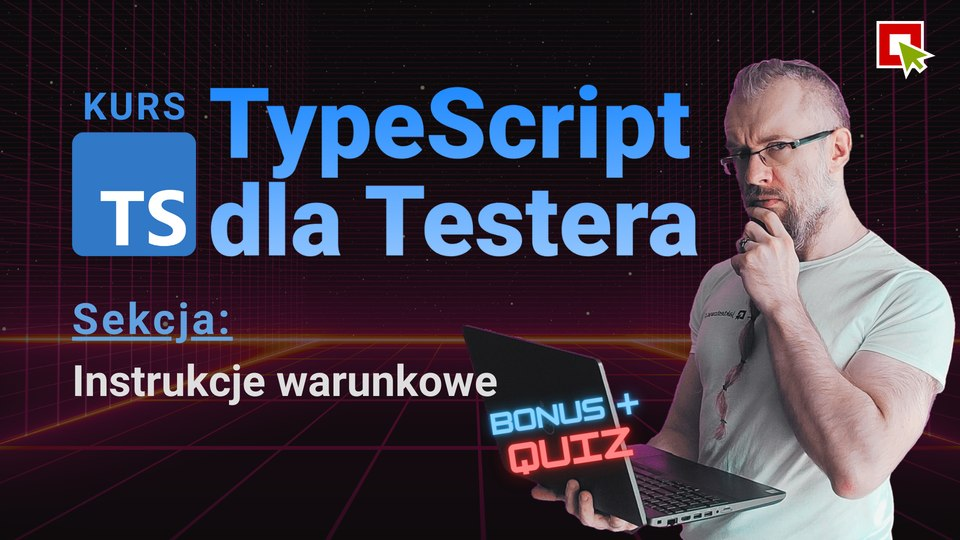

# Conditionals (if, switch, ternary)

> [!IMPORTANT]
> Full recording of all lessons from this section You can find on **YouTube**:
> 

> [!IMPORTANT]
> Check out our free **YouTube** series from this course:
> 
